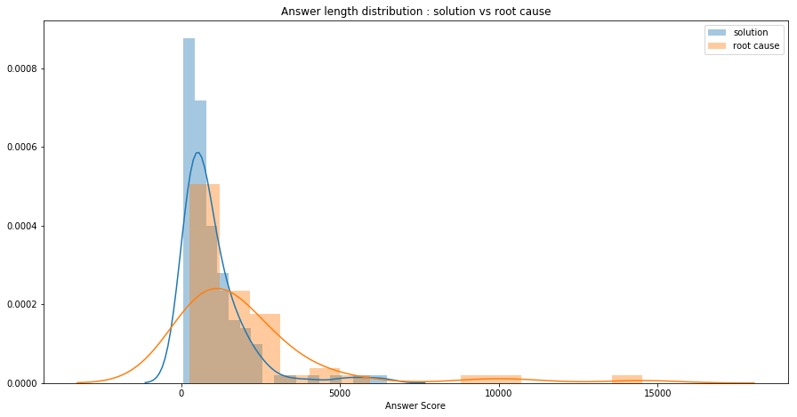
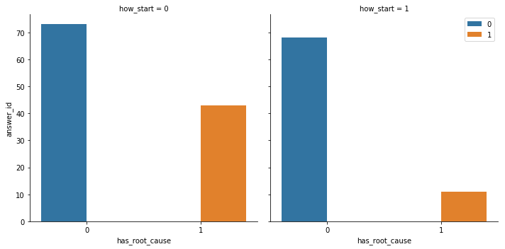
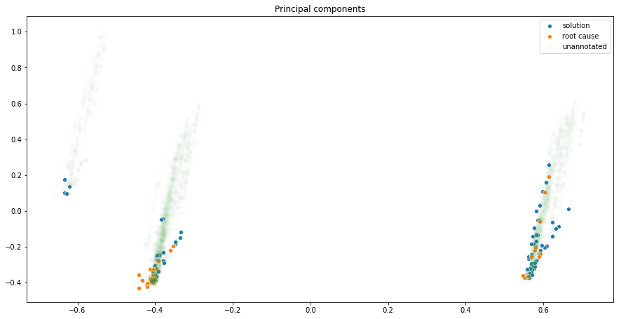
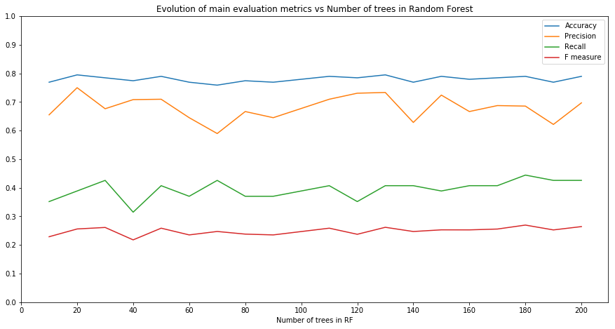
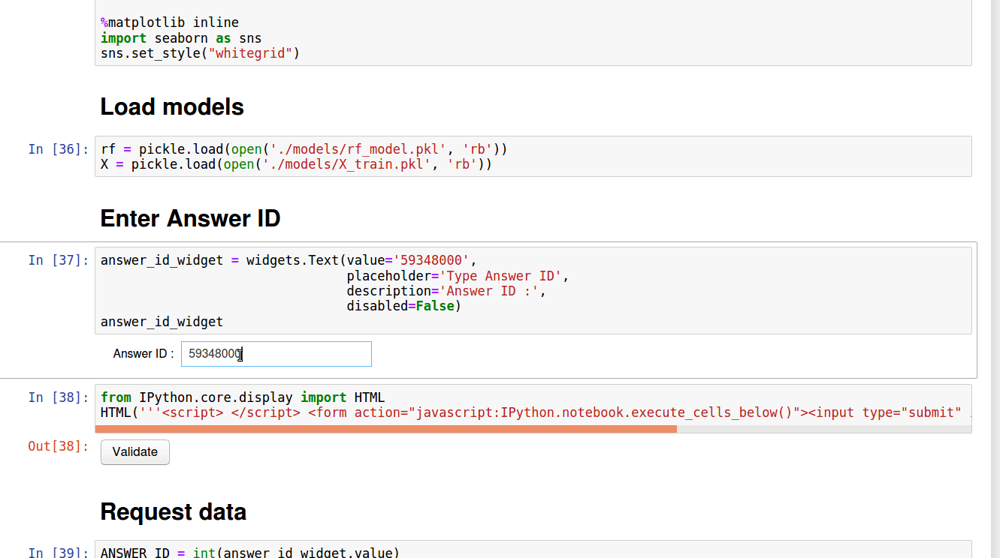

# Stackoverflow Predict Project

In this project, we'll try to determine if a Stackoverflow answer contains just a **solution** or a solution with a **root cause**. This problem can be solved by different solutions :

- Recognize sequences of words that represent a solution or a root cause to a problem. We could use named entity recognition on a label dataset to identify parts of texts that contain one of those sequences.
- Simple binary classification problem : map every answer to the classes {"solution", "root cause"}.

For a first proof-of-concept, we'll prefer the second approach.

# Data
I use the StackExchange API to scrape the content of answers and questions. The class `SofScrapper` allows to access easily to data sources. To generate a more or less representative data sets, I decided to take into accounts recent questions and most popular questions.

# Data processing
After gathering the different **json** files, I created simple features from **textual data**. Intuitively, answers without root cause come from general questions (how ? why ?) and root cause answers are usually longer. Since the training data is not really big (for now), a "simple features" approach feature was preferred to a NLP deep learning  approach. Here a the different features computed :

- `what_start`, `which_start`, `how_start`, `why_start` : Question starts by what, which, how, why.
- `len_question`, `len_question_body`, `len_answer` : Length of the answer, question, question bodies string.
- `nb_strong_tags_question`, `nb_code_tags_question`, etc... : Number of certain specific textual patterns in questions and answers.
- All the scores recorded on Stackoverflow.

# Data annotation
Annotation was performed on around 150 couples of answer / question using a Spreadsheet : 

https://docs.google.com/spreadsheets/d/18GZOkWbBpRI8vMxr5N1AiBeSE9YZ2Piwe8_yU0MboXk/edit?usp=sharing

# Data Analysis

## Answer length
Slight difference of distributions between root cause and solutions on the answer length variable :

## Question starts by How
Question starter features are good discriminators :

## Unsupervised learning attempt
Plotting principal components of the data set confirms that question starters features are good indicators but it's still difficult to figure out how to implement a full unsupervised learning solution.

# Model engineering
Since the data set is pretty small, simple classification models such as decision trees or logistic regressions were considered. But an ensemble method like Random Forest still seems to boost the results.

## Tune model
RF is tuned on the number of decision trees.

The results are evaluated on a leave one out validation (small data set). The small data set doesn't allow us to have a good estimate of the best number of models. A default value was chosen.

## Results
Considering the smallness of the data set, the F measure seems pretty low (around 0.2) but the precision is around 0.75 which allows us to have a system that could potentially be confident on root causes without recalling all of them.

# Production
The algorithm should be hosted on a Flask API with a Docker access. For now you can use the notebook `stackoverflow_predict.ipynb` and follow the filmed instructions :

An explainabilty module was provided using Lime.

# Improvements

- Use more complex models (seq to seq deep learning) on more complex data (NER data sets).
- Use a Flask API in a Docker container.